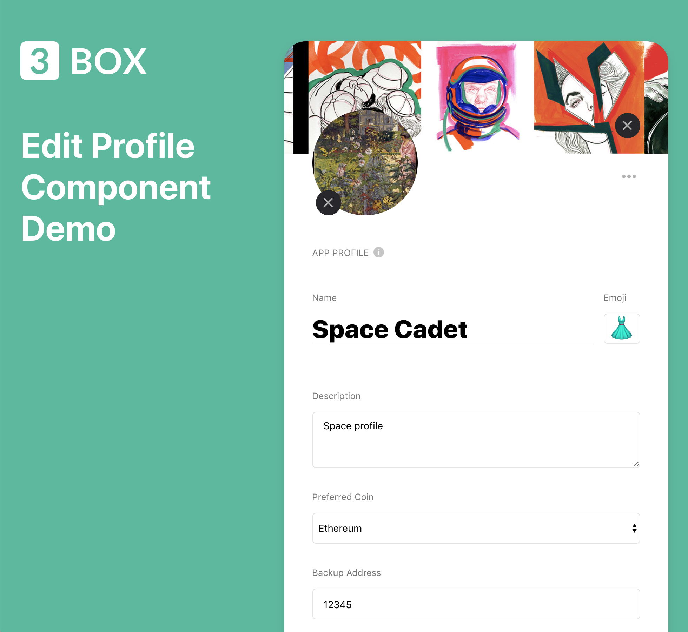

[](https://discordapp.com/invite/Z3f3Cxy)
[](https://www.npmjs.com/package/3box-profile-edit-react)
[](https://twitter.com/3boxdb)

# 3Box Profile Edit Plugin 📝

The `3box-profile-edit-react` node package is a drop-in react component that provides Web3 developers with UI and logic for editing user profiles in their Ethereum application. Quickly add customizable fields that are pertinent to your dapp on top of basic input fields, with the option of `text`, `textarea`, and `select` (dropdown) style inputs. The 3Box Edit Profile plugin is built using 3Box infrastructure. *Read the docs on [docs.3box.io](https://docs.3box.io/build/plugins/chatbox)*.

### Try the demo [here](https://3box.github.io/3box-profile-edit-react/examples/dist/)

</br>

## How it Works
#### Architecture
The Edit Profile plugin implements simple `set` & `get` methods on both the [Profiles API](https://docs.3box.io/api/profiles) and the [Spaces API](https://docs.3box.io/api/storage) for standard fields (`name`, `image`, `coverPhoto`, `emoji`, `description`) depending on which profile the user chooses as their default (`3Box` or `App`), but will use only the Spaces API for custom fields added by the developer passed as a prop to the component. Both methods are made available via the [`3Box.js SDK`](https://github.com/3box/3box-js). After a user has set which default profile they'd like to use, by setting a boolean to the key `isAppProfileDefault` in the space's public store, the dapp should appropriately fetch from that profile elsewhere in the dapp.

#### Authentication
Prior to first render of the Edit Profile component, the dapp should have already run `const box = await Box.openBox(userAddress, ethereumProvider)` and `const space = await box.openSpace(spaceName)` and passed both the `box` and `space` objects as props of the same name.
</br>
</br>

## Getting Started
1. Install the component
2. Configure application settings and props to component
3. Usage
4. Display correct profile in your app

### 1. Install the component

```shell
npm i -S 3box-profile-edit-react
```

### 2. Configure application settings and props to component
**First, choose a name for your application's 3Box space.**

Although you are free to choose whichever name you'd like for your app's space, we recommend using the name of your app. If your application already has a 3Box space, you are welcome to use that same one for the chatbox.

**Then, configure the custom fields you'd like to add to the component**

The `customFields` prop must receive an ***array*** of *any* number of objects in the following structures:
```javascript
    { // for a field with a text input
        inputType: 'text',
        key: 'backupAddress', // the key used to save the value
        field: 'Backup Address' // how to display the key in the UI
      }, 

      { // for a field with a textarea input
        inputType: 'textarea',
        key: 'spiritCryptoKittie',
        field: 'Spirit CryptoKitty'
      },

      { // for a field with a dropdown input
        inputType: 'dropdown',
        key: 'preferredCoin',
        field: 'Preferred Coin',
        options: [{ // dropdown input requires an array of objects
          value: 'eth', // value passed after selection
          display: 'Ethereum' // what the user will see in the dropdown
        }, {
          value: 'btc',
          display: 'Bitcoin'
        }, {
          value: 'ltc',
          display: 'Litecoin'
        }]
      }
```
The Edit Profile component comes standard with `Name`, `Emoji`, and `Description` fields.  The component defaults to using the 3Box profile (as the `isAppProfileDefault` boolean in the space is still undefined). Fields passed to `customFields` however will always be saved to the app's space.

</br>
</br>


### 3. Usage
The Edit Profile component can of course be used in any way the developer pleases, though we recommend it be used on a dedicated edit profile page or in a popup modal (not included) of the developer's design.  Remember, both the `box` and `space` instance must be passed to the component before it mounts.

#### Example

```jsx
import EditProfile from '3box-profile-edit-react';

const MyComponent = ({ customFields, box, space, myAddress, myProfile, redirectFn }) => (
    <EditProfile
        // required
        box={box}
        space={space}
        currentUserAddr={myAddress}

        // optional
        customFields={customFields}
        currentUser3BoxProfile={myProfile}
        redirectFn={redirectFn}
    />
);
```

### 4. Display correct profile in your app
Once a user selects a default profile (3Box or app) the decision should reflect elsewhere in your dapp.  To do this, you should check `isAppProfileDefault` flag, then call `get` on the respective profile for fields `name`, `image`, `coverPhoto`, `emoji`, and `description`.  Custom fields added to the Edit Profile component, however, are all saved to the application profile in the `space` used by your dapp and should `get` from there.

Checking and getting from the appropriate default profile should look something like this:
```javascript
  const isAppProfileDefault = await space.public.get('isAppProfileDefault');

  let profile;
  if (isAppProfileDefault) {
    profile = await Box.getProfile(currentUserAddr);
  } else {
    profile = await space.public.all();
  }

  this.setState({
    name: profile.name,
    image: profile.image,
    coverPhoto: profile.coverPhoto,
    emoji: profile.emoji,
    description: profile.description,
  })
```


#### Prop Types

| Property | Type            | Required          | Description |
| :-------------------------------- | :-------------------------------------------------------- | :------------------------------------------------------------------------------------------------------------- |:--------------------------------------------------------------------------------------------------------------------------------------------------------------------------------------------------------------------------------------------------------------------------------------------------------------------------------------------------------------------------------------------------------------- |
| `box`    | Object         |    True   | The `box` instance returned from running `await Box.openBox(address, web3)` somewhere in your dApp.|
| `space`    | Object         |   True    | The `space` instance returned from running `await box.openSpace(spaceName)` somewhere in your dApp.|
| `currentUserAddr`    | String (Ethereum Address)             | True| The current user's Ethereum address. Used to fetch the user's profile if it's not provided and for other various uses in the component. |
| `customFields`    | Array       |        | An array of any amount of objects structured in one of three ways outlined above.  |
| `currentUser3BoxProfile`    | Object       |       | If passed, it must be the object returned from calling `const currentUser3BoxProfile = await Box.getProfile(myAddress);`.  If this is not passed, the component runs the same static method using the `currentUserAddr` prop |
| `redirectFn`    | Function      |    | A function that runs after saving the fields in the UI is complete, or when a user hits `cancel`.  The user's ethereum address will be passed as a param in the event that the dapp uses this in the route |

## License

MIT
